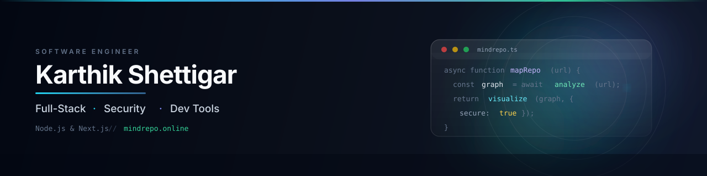

# Hi, I'm Karthik Shettigar

**I build production Node.js & Next.js apps and developer tools — currently shipping [MindRepo](https://mindrepo.online), which turns any GitHub repo into an architecture map.**

**Software Engineer @ NeoSOFT Technologies** · Full-stack · Node.js & Next.js

[Portfolio](https://karthikkk.in) · [Resume](https://karthikkk.in/resume/Karthik_Shettigar_Resume.pdf) · [Email](mailto:kkshettigar24@gmail.com)

---

## Currently

- 🚀 Shipping **[MindRepo](https://mindrepo.online)** — interactive architecture maps for any public GitHub repo
- 💼 Full-stack engineer @ **NeoSOFT Technologies**
- ✍️ Writing on [Medium](https://medium.com/@karthikkk) about MCP, prompt engineering, and security
- 🤝 Open to collaboration on developer tools & open source

---

## About Me

- Full-stack engineer with a **security-first mindset** — background in ethical hacking, penetration testing, and secure API design
- Focused on the **Node.js & Next.js** ecosystem for production web apps and developer tooling
- Writing on Medium about web development, AI tooling, DSA, and cybersecurity

---

## Featured Project: MindRepo

**[MindRepo](https://mindrepo.online)** maps the architecture of any public GitHub repo before you dive into the code — interactive diagrams, deep context, and a faster way to understand unfamiliar codebases.

Built with **Next.js**, **Node.js**, and modern cloud tooling. Born from needing to onboard into large repos without reading every file first.

🔗 **[Try it live →](https://mindrepo.online)** · **[Portfolio](https://karthikkk.in)**

---

## Tech Stack

**Frontend**

**Backend**

**Database**

**Languages**

**Mobile & Cross-platform**

**DevOps**

**Cloud & Hosting**

**Tools & Collaboration**

**Advanced**

---

## Featured Work

| Project | Description |
| --- | --- |
| [Prompt Genie](https://github.com/Karthikkk-24/promptgenie) | AI-powered prompt generation for better LLM prompts |
| [Budget Buddy](https://github.com/Karthikkk-24/BudgetBuddy) | Personal finance tracker with budgeting & expense analytics |
| [PokeDex](https://github.com/Karthikkk-24/pokedex) | Interactive Pokémon encyclopedia with search & filters |
| [Connect Reconnect](https://github.com/Karthikkk-24/ConnectReconnect) | Social networking to reconnect with lost connections |
| [Chat App](https://github.com/Karthikkk-24/chat_app) | Real-time messaging with rooms and DMs |
| [Care Connect](https://github.com/Karthikkk-24/CareConnect) | Healthcare platform connecting patients with providers |
| [Code Knight](https://marketplace.visualstudio.com/items?itemName=KarthikShettigar.code-knight) | VS Code theme pack — elegant & anime-inspired themes |
| [Domain Checker](https://github.com/Karthikkk-24/DomainChecker) | Instant domain availability + WHOIS lookup |
| [Audio Visualizer](https://github.com/Karthikkk-24/AudioVisualizer) | Browser audio visualizer with Web Audio API & Canvas |

---

## Latest Writing

- [MCP Explained: How It’s Different from Traditional APIs](https://medium.com/@karthikkk/mcp-explained-how-its-different-from-traditional-apis-fcb916a91f64)
- [Prompt Engineering Is The New Programming Language](https://medium.com/@karthikkk/prompt-engineering-is-the-new-programming-language-a5aa1bad57c8)
- [The Silent War Between Human Creativity and Machine Precision](https://medium.com/@karthikkk/the-silent-war-between-human-creativity-and-machine-precision-e6eb9ae0ad24)
- [Understanding Java Arrays and Collections Framework](https://medium.com/@karthikkk/understanding-java-arrays-and-collections-framework-fc7ffa7cf6e9)

More on [Medium](https://medium.com/@karthikkk)

---

## GitHub Stats

---

### Let’s connect

[karthikkk.in](https://karthikkk.in) · [LinkedIn](https://www.linkedin.com/in/kks24/) · [Medium](https://medium.com/@karthikkk) · [YouTube](https://www.youtube.com/@thecodinghacker) · [Email](mailto:kkshettigar24@gmail.com)

